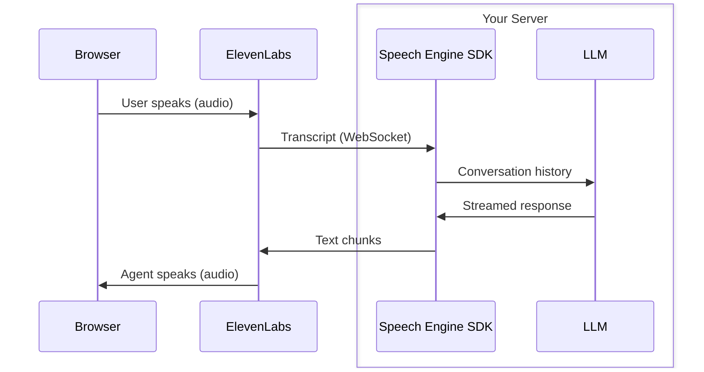

By the end of this guide you will have a working script that sends a text string to the ElevenLabs API and plays the returned audio through your speakers. You will learn how to authenticate with an API key, install the SDK, and make your first text-to-speech request.

<YoutubeEmbed id="W-XF7uo0bpk" />

For guides covering other capabilities — streaming, voice cloning, speech-to-text — see the [Tutorials](/docs/eleven-api/guides/cookbooks) section.

<Tip>
  Use the [ElevenLabs text-to-speech skill](https://github.com/elevenlabs/skills/tree/main/text-to-speech) to generate speech from your AI coding assistant:

```bash
npx skills add elevenlabs/skills --skill text-to-speech
```

</Tip>

## Using the Text to Speech API

<Steps>
    <Step title="Create an API key">
      [Create an API key in the dashboard here](https://elevenlabs.io/app/settings/api-keys), which you’ll use to securely [access the API](/docs/api-reference/authentication).
      
      Store the key as a managed secret and pass it to the SDKs either as a environment variable via an `.env` file, or directly in your app’s configuration depending on your preference.
      
      ```js title=".env"
      ELEVENLABS_API_KEY=<your_api_key_here>
      ```
      
    </Step>
    <Step title="Install the SDK">
      We'll also use the `dotenv` library to load our API key from an environment variable.
      
      <CodeBlocks>
          ```python
          pip install elevenlabs
          pip install python-dotenv
          ```
      
          ```typescript
          npm install @elevenlabs/elevenlabs-js
          npm install dotenv
          ```
      
      </CodeBlocks>
      

      <Note>
        To play the audio through your speakers, you may be prompted to install [MPV](https://mpv.io/)
      and/or [ffmpeg](https://ffmpeg.org/).
      </Note>
    </Step>
    <Step title="Make your first request">
      Create a new file named `example.py` or `example.mts`, depending on your language of choice and add the following code:
       <CodeBlocks>
       ```python
       from dotenv import load_dotenv
       from elevenlabs.client import ElevenLabs
       from elevenlabs.play import play
       import os
       
       load_dotenv()
       
       elevenlabs = ElevenLabs(
         api_key=os.getenv("ELEVENLABS_API_KEY"),
       )
       
       audio = elevenlabs.text_to_speech.convert(
           text="The first move is what sets everything in motion.",
           voice_id="JBFqnCBsd6RMkjVDRZzb",  # "George" - browse voices at elevenlabs.io/app/voice-library
           model_id="eleven_v3",
           output_format="mp3_44100_128",
       )
       
       play(audio)
       
       ```
       
       ```typescript
       import { ElevenLabsClient, play } from "@elevenlabs/elevenlabs-js";
       import "dotenv/config";
       
       const elevenlabs = new ElevenLabsClient();
       const audio = await elevenlabs.textToSpeech.convert(
       	"JBFqnCBsd6RMkjVDRZzb", // "George" - browse voices at elevenlabs.io/app/voice-library
       	{
       		text: "The first move is what sets everything in motion.",
       		modelId: "eleven_v3",
       		outputFormat: "mp3_44100_128",
       	},
       );
       
       await play(audio);
       
       ```
       
       </CodeBlocks>
    </Step>
    <Step title="Run the code">
        <CodeBlocks>
            ```python
            python example.py
            ```

            ```typescript
            npx tsx example.mts
            ```
        </CodeBlocks>

        You should hear the audio play through your speakers.
    </Step>

</Steps>

## Next steps

<CardGroup cols={3}>
  <Card
    title="Stream audio"
    icon="file:assets/icons/tts.svg"
    href="/docs/eleven-api/guides/how-to/text-to-speech/streaming"
  >
    Reduce latency by streaming audio as it generates rather than waiting for the complete file
  </Card>
  <Card
    title="Browse voices"
    icon="file:assets/icons/voices.svg"
    href="https://elevenlabs.io/app/voice-library"
  >
    Explore 10,000+ voices and swap the example voice ID for one that fits your use case
  </Card>
  <Card
    title="Clone a voice"
    icon="file:assets/icons/ivc.svg"
    href="/docs/eleven-api/guides/how-to/voices/instant-voice-cloning"
  >
    Create a custom voice from a short audio recording
  </Card>
</CardGroup>


----

---
title: Speech Engine quickstart
subtitle: Add voice to your chat agent using the ElevenLabs SDK.
---

This guide walks you through building a voice-powered agent with Speech Engine. You set up a server that connects your LLM to ElevenLabs, then wire up a browser client so users can have voice conversations with your agent.

<YoutubeEmbed id="gfCqXM9fTsA" />

<Tip>
  Use the [ElevenLabs Speech Engine skill](https://github.com/elevenlabs/skills/tree/main/speech-engine) to add voice to your chat agent:

```bash
npx skills add elevenlabs/skills --skill speech-engine
```

</Tip>

## How Speech Engine works

Speech Engine connects your LLM to ElevenLabs so that users can speak to your agent and hear it respond. ElevenLabs handles speech-to-text and text-to-speech; your server provides the LLM logic.



Each WebSocket connection represents one conversation. When the user speaks, ElevenLabs transcribes the audio and sends the transcript to your server. Your server passes it to your LLM, then streams the response back. ElevenLabs converts the text to speech and plays it in the browser. The SDK handles connection management, turn-taking, and interruption detection.

## Prerequisites

This tutorial uses OpenAI's API for the LLM. You need an OpenAI API key set in the `OPENAI_API_KEY` environment variable.

## Server setup

<Steps>
    <Step title="Create an API key">
        [Create an API key in the dashboard here](https://elevenlabs.io/app/settings/api-keys), which you’ll use to securely [access the API](/docs/api-reference/authentication).
        
        Store the key as a managed secret and pass it to the SDKs either as a environment variable via an `.env` file, or directly in your app’s configuration depending on your preference.
        
        ```js title=".env"
        ELEVENLABS_API_KEY=<your_api_key_here>
        ```
        
    </Step>
    <Step title="Install dependencies">
        <CodeBlocks>
        ```python
        pip install elevenlabs openai python-dotenv
        ```

        ```typescript
        npm install @elevenlabs/elevenlabs-js openai
        ```
        </CodeBlocks>
    </Step>
    <Step title="Expose the server">
        Speech Engine needs a publicly reachable URL. Use [ngrok](https://ngrok.com) to expose your local server. The server is not built yet, but ngrok needs to be running first so you have the URL for the next step.

        ```bash
        ngrok http 3001
        ```

        Copy the forwarding URL (e.g. `https://abc123.ngrok.io`).
    </Step>
    <Step title="Create a Speech Engine instance">
        Use the SDK to create a Speech Engine instance, passing your ngrok URL with the `/ws` path appended as the WebSocket URL.

        <CodeBlocks>
        ```python title="create_engine.py"
        import asyncio
        from dotenv import load_dotenv
        from elevenlabs import AsyncElevenLabs

        load_dotenv()

        elevenlabs = AsyncElevenLabs(
            api_key=os.getenv("ELEVENLABS_API_KEY"),
        )

        async def main():
            engine = await elevenlabs.speech_engine.create(
                name="My Speech Engine",
                speech_engine={
                    # Note we use the wss protocol instead of https
                    "ws_url": "wss://abc123.ngrok.io/ws",
                },
            )

            print(f"Speech Engine ID: {engine.engine_id}")

        if __name__ == "__main__":
            asyncio.run(main())
        ```

        ```typescript title="create-engine.mts"
        import { ElevenLabsClient } from "@elevenlabs/elevenlabs-js";
        import "dotenv/config";

        const elevenlabs = new ElevenLabsClient({
          apiKey: process.env.ELEVENLABS_API_KEY,
        });

        const engine = await elevenlabs.speechEngine.create({
          name: "My Speech Engine",
          speechEngine: {
            // Note we use the wss protocol instead of https
            wsUrl: "wss://abc123.ngrok.io/ws",
          },
        });

        console.log("Speech Engine ID:", engine.engineId);
        ```
        </CodeBlocks>

        Run this script and copy the Speech Engine ID (e.g. `seng_8k3m9xr4hjnfg983brhmhkd98n6`) for the next step.
    </Step>
    <Step title="Create the server">
        Create a file called `server.py` or `server.mts` with the following contents. This sets up a server, attaches Speech Engine on the `/ws` path, and uses OpenAI to generate responses.

        <CodeBlocks>
        ```python maxLines=0 title="server.py"
        import asyncio
        import os

        from dotenv import load_dotenv
        from openai import AsyncOpenAI
        from elevenlabs import AsyncElevenLabs

        load_dotenv()

        # Replace with your Speech Engine ID from step 4
        SPEECH_ENGINE_ID = "seng_8k3m9xr4hjnfg983brhmhkd98n6"

        openai = AsyncOpenAI(
          api_key=os.getenv("OPENAI_API_KEY"),
        )
        elevenlabs = AsyncElevenLabs(
          api_key=os.getenv("ELEVENLABS_API_KEY"),
        )

        def on_init(conversation_id, session):
            print(f"Session started: {conversation_id}")

        async def on_transcript(transcript, session):
            stream = await openai.responses.create(
                model="gpt-4o",
                instructions="You are a helpful voice assistant. Keep responses concise and conversational.",
                input=[
                    {"role": "assistant" if m.role == "agent" else m.role, "content": m.content}
                    for m in transcript
                ],
                stream=True,
            )

            await session.send_response(stream)

        def on_close(session):
            print(f"Session ended: {session.conversation_id}")

        def on_error(err, session):
            print(f"Error: {err}")

        async def main():
            engine = await elevenlabs.speech_engine.get(SPEECH_ENGINE_ID)

            await engine.serve(
                port=3001,
                path="/ws",
                debug=True,
                on_init=on_init,
                on_transcript=on_transcript,
                on_close=on_close,
                on_error=on_error,
            )

        if __name__ == "__main__":
            asyncio.run(main())
        ```

        ```typescript maxLines=0 title="server.mts"
        import { ElevenLabsClient } from "@elevenlabs/elevenlabs-js";
        import { createServer } from "node:http";
        import OpenAI from "openai";
        import "dotenv/config";

        // Replace with your Speech Engine ID from step 4
        const SPEECH_ENGINE_ID = "seng_8k3m9xr4hjnfg983brhmhkd98n6";

        const elevenlabs = new ElevenLabsClient({
          apiKey: process.env.ELEVENLABS_API_KEY,
        });
        const openai = new OpenAI({
          apiKey: process.env.OPENAI_API_KEY,
        });

        const httpServer = createServer();

        await elevenlabs.speechEngine.attach(SPEECH_ENGINE_ID, httpServer, "/ws", {
          debug: true,

          onInit(conversationId) {
            console.log("Session started:", conversationId);
          },

          async onTranscript(transcript, signal, session) {
            const response = await openai.responses.create(
              {
                model: "gpt-4o",
                instructions:
                  "You are a helpful voice assistant. Keep responses concise and conversational.",
                input: transcript.map((m) => ({
                  role: m.role === "agent" ? "assistant" : m.role,
                  content: m.content,
                })),
                stream: true,
              },
              { signal },
            );

            session.sendResponse(response);
          },

          onClose(session) {
            console.log("Session ended:", session.conversationId);
          },

          onError(err) {
            console.error("Error:", err);
          },
        });

        httpServer.listen(3001, () => {
          console.log("Speech Engine server listening on port 3001");
        });
        ```
        </CodeBlocks>

        The `onTranscript` / `on_transcript` callback receives the full conversation history and the current session. The TypeScript SDK also provides an `AbortSignal` that fires if the user interrupts mid-response. Passing `signal` to the OpenAI call cancels the LLM request automatically on interruption.

        `sendResponse()` / `send_response()` accepts a string, an async iterable, or a stream from OpenAI, Anthropic, or Google Gemini. The SDK extracts the text content automatically.

        <Warning>
          In the above example, the full transcript from the user is passed to the LLM. In a production environment you should add guardrails to prevent any prompt injection or manipulation attempts.
        </Warning>
    </Step>
    <Step title="Start the server">
        <CodeBlocks>
        ```python
        python server.py
        ```

        ```typescript
        npx tsx server.mts
        ```
        </CodeBlocks>
    </Step>

</Steps>

## Client setup

<Steps>
    <Step title="Install the client SDK">
        <Tabs>
        <Tab title="React">
        ```bash
        npm install @elevenlabs/react
        ```
        </Tab>
        <Tab title="JavaScript">
        ```bash
        npm install @elevenlabs/client
        ```
        </Tab>
        </Tabs>
    </Step>
    <Step title="Create a token endpoint">
        Add a server-side endpoint that generates a conversation token. This keeps your API key out of the browser and uses WebRTC for the best audio quality.

        <CodeBlocks>
        ```python title="token_server.py"
        import os

        from dotenv import load_dotenv
        from flask import Flask, jsonify
        from elevenlabs import ElevenLabs

        load_dotenv()

        app = Flask(__name__)
        elevenlabs = ElevenLabs(
            api_key=os.getenv("ELEVENLABS_API_KEY"),
        )

        @app.route("/api/token")
        def get_token():
            # Replace with your Speech Engine ID from step 4 of the server setup
            speech_engine_id = "seng_8k3m9xr4hjnfg983brhmhkd98n6"

            response = elevenlabs.conversational_ai.conversations.get_webrtc_token(
                agent_id=speech_engine_id,
            )

            return jsonify(token=response.token)

        if __name__ == "__main__":
            app.run(port=3002)
        ```

        ```typescript title="token-server.mts"
        import express from "express";
        import { ElevenLabsClient } from "@elevenlabs/elevenlabs-js";
        import "dotenv/config";

        const app = express();
        const elevenlabs = new ElevenLabsClient({
          apiKey: process.env.ELEVENLABS_API_KEY,
        });

        app.get("/api/token", async (req, res) => {
          // Replace with your Speech Engine ID from step 4 of the server setup
          const speechEngineId = "seng_8k3m9xr4hjnfg983brhmhkd98n6";

          const response = await elevenlabs.conversationalAi.conversations.getWebrtcToken({
            agentId: speechEngineId,
          });

          res.json({ token: response.token });
        });

        app.listen(3002, () => {
          console.log("Token server listening on port 3002");
        });
        ```
        </CodeBlocks>
    </Step>
    <Step title="Build the conversation UI">
        Fetch the conversation token from your server and use it to start a session.

        <Tabs>
        <Tab title="React">
        ```tsx title="App.tsx"
        import { useConversation } from "@elevenlabs/react";
        import { useCallback } from "react";

        async function getToken(): Promise<string> {
          const response = await fetch("/api/token");
          if (!response.ok) {
            throw Error("Failed to get conversation token");
          }
          const data = await response.json();
          return data.token;
        }

        export default function App() {
          const conversation = useConversation({
            onConnect: () => console.log("Connected"),
            onDisconnect: () => console.log("Disconnected"),
            onError: (error: Error) => console.error("Error:", error),
          });

          const startConversation = useCallback(async () => {
            await navigator.mediaDevices.getUserMedia({ audio: true });
            const token = await getToken();
            await conversation.startSession({ conversationToken: token });
          }, [conversation]);

          const stopConversation = useCallback(async () => {
            await conversation.endSession();
          }, [conversation]);

          return (
            <div>
              <p>Status: {conversation.status}</p>
              <button onClick={startConversation} disabled={conversation.status === "connected"}>
                Start conversation
              </button>
              <button onClick={stopConversation} disabled={conversation.status !== "connected"}>
                End conversation
              </button>
            </div>
          );
        }
        ```
        </Tab>
        <Tab title="JavaScript">
        ```typescript title="main.ts"
        import { Conversation } from "@elevenlabs/client";

        let conversation: Conversation | null = null;

        async function getToken(): Promise<string> {
          const response = await fetch("/api/token");
          if (!response.ok) throw Error("Failed to get conversation token");
          const data = await response.json();
          return data.token;
        }

        document.getElementById("start")!.addEventListener("click", async () => {
          await navigator.mediaDevices.getUserMedia({ audio: true });
          const token = await getToken();

          conversation = await Conversation.startSession({
            conversationToken: token,
            onConnect: () => {
              document.getElementById("status")!.textContent = "Connected";
              (document.getElementById("start") as HTMLButtonElement).disabled = true;
              (document.getElementById("stop") as HTMLButtonElement).disabled = false;
            },
            onDisconnect: () => {
              document.getElementById("status")!.textContent = "Disconnected";
              (document.getElementById("start") as HTMLButtonElement).disabled = false;
              (document.getElementById("stop") as HTMLButtonElement).disabled = true;
            },
            onError: (error) => console.error("Error:", error),
          });
        });

        document.getElementById("stop")!.addEventListener("click", () => {
          if (conversation) conversation.endSession();
        });
        ```
        </Tab>
        </Tabs>
    </Step>
    <Step title="Try it out">
        Make sure three processes are running:

        1. **ngrok** - forwarding to port 3001
        2. **Your Speech Engine server** - `python server.py` or `npx tsx server.mts`
        3. **The token server** - `npx tsx token-server.mts` or `python token_server.py`

        Open your client application in the browser and click **Start conversation**. Grant microphone access when prompted, then speak. You should hear the agent respond through your speakers.

        If you have `debug: true` enabled on the server, you will see incoming transcripts and outgoing responses logged to the console.
    </Step>

</Steps>

## Session events

| Event             | TypeScript callback | Python callback | Description                                                                      |
| ----------------- | ------------------- | --------------- | -------------------------------------------------------------------------------- |
| `user_transcript` | `onTranscript`      | `on_transcript` | User speech transcribed. Includes full conversation history and an abort signal. |
| `init`            | `onInit`            | `on_init`       | Session initialized with a conversation ID.                                      |
| `close`           | `onClose`           | `on_close`      | Clean disconnect from ElevenLabs.                                                |
| `disconnected`    | `onDisconnect`      | `on_disconnect` | WebSocket dropped unexpectedly.                                                  |
| `error`           | `onError`           | `on_error`      | Protocol or WebSocket error.                                                     |

## Configuring the first agent message

By default, the agent waits for the user to speak first. To have the agent greet the user when the conversation starts, set a first message in the `overrides` option on the client when starting the session.

<Steps>
  <Step>
    To allow the agent to speak first, we need to update the Speech Engine resource to allow setting this from the client.

    <CodeBlocks>
      ```python
      engine = await elevenlabs.speech_engine.update(
          speech_engine_id="seng_8k3m9xr4hjnfg983brhmhkd98n6",
          overrides={
            "first_message": True,
          },
      )
      ```

      ```typescript
      const engine = await elevenlabs.speechEngine.update("seng_8k3m9xr4hjnfg983brhmhkd98n6", {
        overrides: {
          firstMessage: true,
        },
      });
      ```
    </CodeBlocks>

  </Step>
  <Step>
    Then we configure the first message in the client SDK.

    <Tabs>
      <Tab title="React">
      ```tsx
      conversation.startSession({
        conversationToken: token,
        overrides: {
          agent: {
            firstMessage: "Hello! How can I help you today?",
          },
        },
      });
      ```
      </Tab>
      <Tab title="JavaScript">
      ```typescript
      const conversation = await Conversation.startSession({
        conversationToken: token,
        overrides: {
          agent: {
            firstMessage: "Hello! How can I help you today?",
          },
        },
      });
      ```
      </Tab>
      </Tabs>

  </Step>
</Steps>

The first message is spoken by the agent as soon as the connection is established. It does not trigger the `onTranscript` callback on your server - it is handled entirely on the ElevenLabs side.

## Next steps

<CardGroup cols={2}>

<Card
  title="JavaScript SDK reference"
  icon="fa-brands fa-js"
  href="/docs/eleven-api/resources/libraries/speech-engine/javascript-sdk-reference"
>
  Classes, methods, and events for the JavaScript SDK.
</Card>

<Card
  title="Python SDK reference"
  icon="fa-brands fa-python"
  href="/docs/eleven-api/resources/libraries/speech-engine/python-sdk-reference"
>
  Classes, methods, and events for the Python SDK.
</Card>

<Card title="API reference" icon="duotone book" href="/docs/api-reference/speech-engine/create">
  Explore all Speech Engine parameters and response formats.
</Card>

<Card
  title="Next.js example app"
  icon="fa-brands fa-github"
  href="https://github.com/elevenlabs/examples/tree/main/speech-engine/nextjs/quickstart"
>
  Run a complete Speech Engine quickstart app locally.
</Card>

</CardGroup>


---
---
title: Text to Dialogue quickstart
subtitle: Learn how to generate immersive dialogue from text.
---

This guide will show you how to generate immersive, natural-sounding dialogue from text using the Text to Dialogue API.

<Warning>
  Keep the total length of all `inputs[].text` values at or below 2,000 characters per request for
  reliable generation. Split longer scripts into chunks and stitch the audio client-side.
</Warning>

## Using the Text to Dialogue API

<Steps>
    <Step title="Create an API key">
        [Create an API key in the dashboard here](https://elevenlabs.io/app/settings/api-keys), which you’ll use to securely [access the API](/docs/api-reference/authentication).
        
        Store the key as a managed secret and pass it to the SDKs either as a environment variable via an `.env` file, or directly in your app’s configuration depending on your preference.
        
        ```js title=".env"
        ELEVENLABS_API_KEY=<your_api_key_here>
        ```
        
    </Step>
    <Step title="Install the SDK">
        We'll also use the `dotenv` library to load our API key from an environment variable.
        
        <CodeBlocks>
            ```python
            pip install elevenlabs
            pip install python-dotenv
            ```
        
            ```typescript
            npm install @elevenlabs/elevenlabs-js
            npm install dotenv
            ```
        
        </CodeBlocks>
        
    </Step>
    <Step title="Make the API request">
        Create a new file named `example.py` or `example.mts`, depending on your language of choice, and add the following code.
        Add audio tags inside each `text` value to guide that speaker's delivery. The `voice_id`
        selects the speaker voice for the same input item.

        <CodeBlocks>
        ```python focus={12-21} maxLines=0
        # example.py
        import os

        from dotenv import load_dotenv
        from elevenlabs.client import ElevenLabs
        from elevenlabs.play import play

        load_dotenv()

        elevenlabs = ElevenLabs(
          api_key=os.getenv("ELEVENLABS_API_KEY"),
        )

        audio = elevenlabs.text_to_dialogue.convert(
            inputs=[
                {
                    "text": "[cheerfully] Hello, how are you?",
                    "voice_id": "9BWtsMINqrJLrRacOk9x",
                },
                {
                    "text": "[stuttering] I'm... I'm doing well, thank you.",
                    "voice_id": "IKne3meq5aSn9XLyUdCD",
                }
            ]
        )

        play(audio)
        ```

        ```typescript focus={7-17} maxLines=0
        // example.mts
        import { ElevenLabsClient, play } from "@elevenlabs/elevenlabs-js";
        import "dotenv/config";

        const elevenlabs = new ElevenLabsClient();

        const audio = await elevenlabs.textToDialogue.convert({
            inputs: [
                {
                    text: "[cheerfully] Hello, how are you?",
                    voiceId: "9BWtsMINqrJLrRacOk9x",
                },
                {
                    text: "[stuttering] I'm... I'm doing well, thank you.",
                    voiceId: "IKne3meq5aSn9XLyUdCD",
                },
            ],
        });

        play(audio);
        ```
        </CodeBlocks>
    </Step>
    <Step title="Execute the code">
        <CodeBlocks>
            ```python
            python example.py
            ```

            ```typescript
            npx tsx example.mts
            ```
        </CodeBlocks>

        You should hear the dialogue audio play.
    </Step>

</Steps>

## Next steps

<CardGroup cols={3}>
  <Card
    title="Browse voices"
    icon="file:assets/icons/voices.svg"
    href="https://elevenlabs.io/app/voice-library"
  >
    Explore 10,000+ voices to assign to each dialogue speaker
  </Card>
  <Card
    title="Text to Speech"
    icon="file:assets/icons/tts.svg"
    href="/docs/eleven-api/guides/cookbooks/text-to-speech"
  >
    Generate speech from a single voice with the Text to Speech API
  </Card>
  <Card
    title="API reference"
    icon="duotone book"
    href="/docs/api-reference/text-to-dialogue/convert"
  >
    Explore all Text to Dialogue parameters and response formats
  </Card>
</CardGroup>

--

---
title: Sound Effects quickstart
subtitle: Learn how to generate sound effects using the Sound Effects API.
---

This guide will show you how to generate sound effects using the Sound Effects API.

<Tip>
  Use the [ElevenLabs sound-effects skill](https://github.com/elevenlabs/skills/tree/main/sound-effects) to generate sound effects from your AI coding assistant:

```bash
npx skills add elevenlabs/skills --skill sound-effects
```

</Tip>

## Using the Sound Effects API

<Steps>
    <Step title="Create an API key">
        [Create an API key in the dashboard here](https://elevenlabs.io/app/settings/api-keys), which you’ll use to securely [access the API](/docs/api-reference/authentication).
        
        Store the key as a managed secret and pass it to the SDKs either as a environment variable via an `.env` file, or directly in your app’s configuration depending on your preference.
        
        ```js title=".env"
        ELEVENLABS_API_KEY=<your_api_key_here>
        ```
        
    </Step>
    <Step title="Install the SDK">
        We'll also use the `dotenv` library to load our API key from an environment variable.
        
        <CodeBlocks>
            ```python
            pip install elevenlabs
            pip install python-dotenv
            ```
        
            ```typescript
            npm install @elevenlabs/elevenlabs-js
            npm install dotenv
            ```
        
        </CodeBlocks>
        

        <Note>
            To play the audio through your speakers, you may be prompted to install [MPV](https://mpv.io/)
            and/or [ffmpeg](https://ffmpeg.org/).
        </Note>
    </Step>
    <Step title="Make the API request">
        Create a new file named `example.py` or `example.mts`, depending on your language of choice and add the following code:

        <CodeBlocks>
        ```python maxLines=0
        # example.py
        import os
        from dotenv import load_dotenv
        from elevenlabs.client import ElevenLabs
        from elevenlabs.play import play

        load_dotenv()

        elevenlabs = ElevenLabs(
          api_key=os.getenv("ELEVENLABS_API_KEY"),
        )
        audio = elevenlabs.text_to_sound_effects.convert(text="Cinematic Braam, Horror")

        play(audio)
        ```

        ```typescript
        // example.mts
        import { ElevenLabsClient, play } from "@elevenlabs/elevenlabs-js";
        import "dotenv/config";

        const elevenlabs = new ElevenLabsClient();

        const audio = await elevenlabs.textToSoundEffects.convert({
          text: "Cinematic Braam, Horror",
        });

        await play(audio);
        ```
        </CodeBlocks>
    </Step>
    <Step title="Execute the code">
        <CodeBlocks>
            ```python
            python example.py
            ```

            ```typescript
            npx tsx example.mts
            ```
        </CodeBlocks>

        You should hear your generated sound effect playing through your speakers.
    </Step>

</Steps>

## Next steps

<CardGroup cols={3}>
  <Card
    title="Sound effects overview"
    icon="file:assets/icons/sfx.svg"
    href="/docs/overview/capabilities/sound-effects"
  >
    Learn about sound effect generation, supported formats, and use cases
  </Card>
  <Card title="Text to Speech" icon="file:assets/icons/tts.svg" href="/docs/eleven-api/quickstart">
    Generate spoken audio from text with the Text to Speech API
  </Card>
  <Card
    title="API reference"
    icon="duotone book"
    href="/docs/api-reference/text-to-sound-effects/convert"
  >
    Explore all Sound Effects parameters and response formats
  </Card>
</CardGroup>